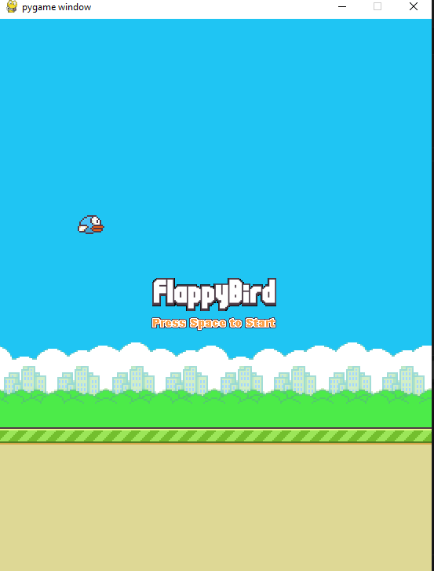

# 🐤 Flappy Bird Game in Python (Pygame)

A beginner-friendly Flappy Bird clone created using Python and Pygame. This was developed as part of an academic project during my first semester in Computer Science.

> 🎮 Press `SPACE` to flap and dodge the pipes. Hit `R` to restart after game over!

---

## 📸 Screenshot



---

## 🚀 Features

- Animated bird with realistic flapping physics  
- Moving ground and dynamic background  
- Randomized pipe heights  
- Collision detection (pipes and ground)  
- Score tracking and display  
- Start and Game Over screens  

---

## 🛠️ Tech Stack

- **Language**: Python 3  
- **Library**: [Pygame](https://www.pygame.org/)

---

## 📂 Folder Structure

```

flappy-bird/
├── assets/
│   ├── background.png
│   ├── bird\_down.png
│   ├── bird\_mid.png
│   ├── bird\_up.png
│   ├── ground.png
│   ├── pipe\_top.png
│   ├── pipe\_bottom.png
│   ├── game\_over.png
│   └── start.png
├── flappy\_bird.py
└── README.md

````

---

## ⚙️ How to Run

1. **Clone the repository**:
   ```bash
   git clone https://github.com/your-username/flappy-bird-game.git
   cd flappy-bird-game
````

2. **Install Pygame**:

   ```bash
   pip install pygame
   ```

3. **Run the game**:

   ```bash
   python flappy_bird.py
   ```

✅ Press `SPACE` to start flying
🔁 Press `R` to restart after game over
❌ Close the window to quit

---

## 🙌 Credits

This game was created as a group project by a team of four students during Semester 1 at AIU as part of our academic journey in Computer Science.


---

## ⭐ GitHub Tags

`#python` `#pygame` `#flappybird` `#gamedev` `#beginner-project` `#student-project`

```
